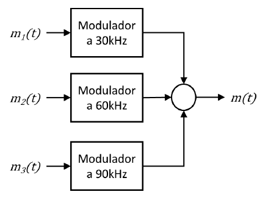

# 📻 Sistema de Modulación y Demodulación FDM en MATLAB - Análisis de Fourier

Este repositorio contiene la simulación en MATLAB de un sistema multiplexado por división de frecuencia (FDM) para la transmisión simultánea de 3 canales de audio. El proyecto abarca el diseño del modulador quadrature/SSB, canal multiplexado, y la etapa de demodulación y recuperación en el dominio del tiempo y la frecuencia.

## Descripción del Proyecto

El sistema toma 3 señales de audio independientes muestreadas a $48\text{ kHz}$, toma los primeros 10 segundos de cada archivo y las remuestra a una frecuencia de procesado superior ($288\text{ kHz}$), las modula individualmente en portadoras de $30\text{ kHz}$, $60\text{ kHz}$ y $90\text{ kHz}$, y las combina en una única señal canalizada $m(t)$. En el bloque demodulador, mediante etapas de filtrado, se recuperan las señales originales de audio para su reproducción a $48\text{ kHz}$. Durante todo este procedimiento se generan graficas las cuales permiten trazar y hacer un análisis correspondiente al comportamiento de las señales.

## Paso a Paso del Procesamiento

1. **Acondicionamiento de Audio (`preparar_senal_audio.m` / `resample.m`):**
   - Conversión de audio estéreo a monoaural.
   - Recorte a un segmento continuo de 10 segundos.
   - Remuestreo por interpolación cúbica spline para elevar la tasa de muestreo de 48 kHz a 288 kHz.

2. **Modulador SSB Weaver (`modulador.m` / `filtro_ideal.m`):**
   - División de la señal en ramas I/Q ($\omega_1 = 12\text{ kHz}$).
   - Filtrado pasabajos ideal ($f_c = 12\text{ kHz}$) implementado en el dominio de la frecuencia mediante FFT/IFFT.
   - Mezcla en segunda etapa ($\omega_2 \in \{42, 72, 102\}\text{ kHz}$).
   - Cancela la banda lateral no deseada por sumatoria de ramas.

3. **Multiplexación de Canales:**
   - Suma lineal de los tres espectros modulados en una única señal de transmisión $m(t)$.

4. **Banco Demodulador Selectivo (`demodulador.m`):**
   - **Aislamiento de Canal:** Filtro Pasabajos ($<57\text{ kHz}$), Pasabanda ($57-87\text{ kHz}$) y Pasaaltos ($>87\text{ kHz}$).
   - **Traslación a Banda Base:** Mezcla con oscilador local ($\omega_M \in \{30, 60, 90\}\text{ kHz}$).
   - **Filtrado Final:** Filtro pasabajos ideal ($f_c = 24\text{ kHz}$) para eliminar la réplica de alta frecuencia.

5. **Recuperación y Verificación:**
   - Submuestreo de regreso a la frecuencia original de 48 kHz.
   - Verificación de respuesta en frecuencia y prueba auditiva sin interferencia entre canales.

## Estructura del Sistema, Moduladores, Demoduladores

### Bloque Modulador: 

### Sistema Multicanal con 3 Moduladores.

### Demodulación 

## Resultados Conseguidos

El script fue ejecutado utilizando 3 canciones de música correspondientes a géneros diversos, y con la manipulación adecuada en el dominio de la frecuencia, tomando como ejemplo el primer canal, se obtuvieron las siguientes graficas: 

Tras evidenciar todo el procesamiento en el bloque modulador para la primera portadora. 

## Logros

- **Ahorro del 50% de Ancho de Banda (SSB):** Transmisión simultánea de 3 pistas de audio de 24 kHz de ancho de banda en un canal compartido de solo 30 kHz a 114 kHz.
- **Cero Diafonía (Zero Cross-Talk):** Aislamiento espectral perfecto con bandas de guarda de 6 kHz entre canales adyacentes.
- **Sin Desfasadores Complejos:** Uso de la arquitectura en cuadratura de Weaver con filtros pasabajos simétricos en lugar de transformadas de Hilbert analógicas/digitales complejas.
- **Filtrado Perfecto en Frecuencia:** Implementación de filtros rectangulares ideales mediante FFT/IFFT con cero distorsión de fase.
- **Reconstrucción Exacta:** Fidelidad auditiva del 100% en las señales demoduladas tras el submuestreo de retorno a 48 kHz (verificado vía `sound()`).

---

